%% ============================================================
%% Project Navigator — Modelo de datos propuesto (v5)
%%
%% DOS ALMACENES (híbrido, migrando hacia más Turso):
%%  [TURSO]  = identidad, integridad-crítica, sensible, estado
%%             generado por el app. Llaves `id` únicas y estables.
%%             FK/UNIQUE las impone SQLite de verdad.
%%  [SHEETS] = lo que negocio (PM) edita a diario. Referencia a
%%             entidades de Turso por `id` vía dropdown de Data
%%             Validation (muestra nombre, guarda id) — gestionado
%%             desde /admin, NUNCA se teclea el id a mano.
%%
%% DECISIONES CLAVE v5:
%%  - Llave de unión = `id` (NO email). email es solo atributo
%%    de contacto/match.
%%  - EQUIPO (antes PERSON): registro canónico ÚNICO del equipo
%%    (Turso). Lo mantienen los PM desde /admin. Sin duplicar.
%%  - USER (Better-Auth, intacto) = SOLO quien hace login. Apunta
%%    a EQUIPO vía equipoId (0..1). Login = existe fila USER ligada.
%%  - "rol" son TRES ejes ortogonales, NO mezclar:
%%    (1) EQUIPO.role_id -> ROLES = BANDA de costo (1 de los 12 de
%%        la hoja Costos; drives ROLE_RATES). NULL si RH no la asignó
%%        — el título de Cursos NO trae seniority, no se infiere.
%%    (2) EQUIPO.title = TÍTULO funcional real (Full-Stack Developer,
%%        Mobile Engineer, Tech Lead...). Texto libre de Cursos.Rol,
%%        para display/directorio. NO referencia ROLES.
%%    (3) USER.role = rol de PERMISOS (admin/pm/dev/ventas...).
%%    Los roles de RELACIÓN de proyecto (PM/arquitecto/dev de un
%%    proyecto) NO son nada de lo anterior: viven en
%%    PROJECTS.pm_id/arquitecto_id y PROJECT_DEVELOPERS.
%%  - EQUIPO.active = "sigue en el equipo" (tracking), NO "acceso".
%%  - COSTO = dos verdades, dos tablas, NUNCA columna en ROLES:
%%      EQUIPO_RATES = pago REAL por persona (confidencial).
%%      ROLE_RATES   = costo ESTÁNDAR por puesto (fallback).
%%    Ambas con valid_from/valid_to (historia = filas en el tiempo).
%%    Resolución en app: persona+fecha -> EQUIPO_RATES vigente; si
%%    no hay -> su puesto -> ROLE_RATES vigente.
%%  - TODO el modelo financiero (hoja Costos) migra a Turso por ser
%%    sensible/privado, INCREMENTALMENTE. ROLE_RATES + FINANCIAL_MODEL
%%    ya modelados aquí como [TURSO]. La hoja Costos se elimina al
%%    final de esa migración.
%%  - SNAPSHOTS: vive en Turso (cron-managed). Fuera del modelo de
%%    negocio — ver nota "Alcance del diagrama" al final.
%%  - Desbloquea Fase 5 de roles/permisos (scoping por identidad):
%%    usuario logueado -> USER.equipoId -> EQUIPO.id -> filtra
%%    filas de Sheets por pm_id/developer_id/asignado_id.
%% ============================================================

```mermaid
erDiagram
    %% ---- [TURSO] Identidad, puestos y costo ----
    EQUIPO ||--o| USER : "puede tener acceso (login)"
    EQUIPO }o--|| ROLES : "tiene puesto"
    EQUIPO ||--o{ EQUIPO : "reporta a (jefe directo)"
    EQUIPO ||--o{ EQUIPO_RATES : "pago real (confidencial)"
    ROLES  ||--o{ ROLE_RATES : "costo estándar (confidencial)"

    %% ---- [TURSO->SHEETS] EQUIPO referenciada desde Sheets por id ----
    EQUIPO ||--o{ PROJECTS : "es PM de"
    EQUIPO ||--o{ PROJECTS : "es Arquitecto de"
    EQUIPO ||--o{ PROJECT_DEVELOPERS : "participa en"
    EQUIPO ||--o{ TASKS : "asignado a"
    EQUIPO ||--o| COURSE_PROGRESS : "tiene progreso"

    %% ---- [SHEETS] Negocio ----
    CLIENTS  ||--o{ PROJECTS : "dueño de"
    PROJECTS ||--o{ PROJECT_DEVELOPERS : "tiene"
    PROJECTS ||--o{ TASKS : "contiene"
    PROJECTS ||--o{ PROJECT_DEPENDENCIES : "bloqueado por"
    PROJECTS ||--o{ PROJECT_DEPENDENCIES : "bloquea a"
    SPRINTS  ||--o{ TASKS : "agendada en"

    %% ===================== [TURSO] =====================
    EQUIPO {
        string  id PK "Llave única estable — referenciada por TODO"
        string  full_name "Nombre completo canónico"
        string  nickname "Apodo usado en Projects (Lore, Ale, Dave)"
        string  role_id FK "-> ROLES.id = BANDA de costo (1 de 12). NULL si RH no la asignó"
        string  title "Título funcional real (Cursos.Rol, display). Texto libre, NO FK"
        string  department "OU"
        string  manager_id FK "-> EQUIPO.id (jefe directo)"
        string  email "Contacto/match — NO es la llave"
        boolean active "Sigue en el equipo (tracking) — NO = acceso"
    }
    USER {
        string  id PK "Better-Auth (intacto)"
        string  equipoId FK "-> EQUIPO.id (nullable). El PUENTE."
        string  name
        string  email UK "Credencial de login"
        string  role "Rol de PERMISOS (admin/pm/dev/ventas...)"
        boolean emailVerified
        boolean banned
    }
    ROLES {
        string id PK "slug legible: desarrollador-sr, qa..."
        string name UK "Puesto exacto de la hoja Costos (17: 12 originales + cio/desarrollador-mid/desarrollador-trainee/ed-tech/service-manager)"
    }
    %% Pago REAL por persona, con vigencia. Confidencial -> Turso.
    EQUIPO_RATES {
        string  id PK
        string  equipo_id FK "-> EQUIPO.id"
        decimal hourly_cost
        decimal monthly_cost
        date    valid_from "Inicio vigencia"
        date    valid_to "Fin vigencia (vacío = vigente)"
    }
    %% Costo ESTÁNDAR por puesto, con vigencia. Reemplaza el
    %% Costo/hora de la hoja Costos. Fallback de EQUIPO_RATES.
    ROLE_RATES {
        string  id PK
        string  role_id FK "-> ROLES.id"
        decimal hourly_cost
        decimal monthly_cost
        date    valid_from
        date    valid_to
    }
    %% Modelo de pricing (hoja Costos filas 13-21). Migra a Turso
    %% INCREMENTALMENTE. App-critical: applyFinancialModel().
    %% Singleton de configuración (sin relaciones).
    FINANCIAL_MODEL {
        decimal costo_operativo
        decimal valor_experiencia_rate
        decimal costo_admin_rate
        decimal margen_rate
        decimal iva_rate
        decimal total
    }

    %% ===================== [SHEETS] ====================
    CLIENTS {
        string id PK
        string name UK "Normaliza 'BIT' vs 'Bit Technologies'"
        string cuenta "Agrupador comercial (opcional)"
    }
    PROJECTS {
        string  id PK
        string  numero "# correlativo"
        string  folio UK "Llave natural — usada en URLs (slugs.ts)"
        string  actividad "Nombre del proyecto"
        string  cliente_id FK "-> CLIENTS.id"
        string  arquitecto_id FK "-> EQUIPO.id"
        string  pm_id FK "-> EQUIPO.id"
        string  salud
        string  accion_requerida
        date    fecha_accion
        decimal progreso "0..1"
        string  tipo
        string  prioridad
        string  epica
        string  hito
        string  cuenta
        integer puntos
        string  estatus
        date    fecha_registro
        date    fecha_inicio
        date    fin_estimado
        date    fin_real
        string  url
    }
    %% Normaliza el CSV libre `requiere de` actual
    PROJECT_DEPENDENCIES {
        string project_folio FK "-> PROJECTS.folio"
        string depends_on_folio FK "-> PROJECTS.folio"
    }
    PROJECT_DEVELOPERS {
        string  project_folio FK "-> PROJECTS.folio"
        string  developer_id FK "-> EQUIPO.id"
        decimal allocation_pct "Opcional: % de dedicación"
    }
    SPRINTS {
        string  id PK "OPCIONAL/NUEVO — no hay dato hoy"
        string  name "e.g. Sprint 1, Enero 2024"
        integer year
        integer quarter "1..4"
        integer month "1..12"
        date    start_date
        date    end_date
    }
    %% Unifica pestañas `app` + `Core`. CIERRA el hueco actual:
    %% hoy las tareas NO ligan a su proyecto.
    TASKS {
        string  id PK
        string  project_folio FK "-> PROJECTS.folio (NUEVO, obligatorio)"
        string  sprint_id FK "-> SPRINTS.id (nullable)"
        string  producto "Discriminador: App | Core"
        integer orden
        string  funcionalidad
        string  nombre
        string  descripcion
        string  tipo
        string  asignado_id FK "-> EQUIPO.id"
        string  estatus
        date    fecha_inicio
        date    fecha_fin
        decimal tiempo_et "solo App"
        decimal estimacion "solo App (= story points)"
        decimal puntos "Core: pts | App: estimacion"
    }
    %% 1 fila por persona con progreso AGREGADO (no catálogo de cursos)
    COURSE_PROGRESS {
        string  equipo_id PK "-> EQUIPO.id"
        integer pids_creados
        decimal progreso "0..100"
    }
```

## Alcance del diagrama

Este diagrama modela el **dominio de negocio**, no el esquema físico completo.

**Estado de implementación:** `ROLES` (17 filas), `EQUIPO` (con campo `title`), `EQUIPO_RATES` y la columna `USER.equipoId` ya están en código (`src/db/migrations/2026-equipo.sql` + `src/db/migrations/2026-equipo-title.sql` + `src/db/auth-schema.sql`); el resto es propuesta. La migración del modelo financiero (`ROLE_RATES`, `FINANCIAL_MODEL`) a Turso es **incremental** — la hoja Costos sigue viva hasta completarla.

**Pendiente de modelar:** la hoja Costos también tiene `Recursos`/`Horas/recurso`/`Horas` por puesto, que **no son tarifas** sino supuestos de capacidad/presupuesto. Su hogar (tabla aparte vs atributos de planeación) se decide al migrar esa hoja — fuera de `ROLE_RATES` a propósito.

Tablas de Turso que **existen y se mantienen** pero se omiten por ser infraestructura/estado, no modelo de negocio:

| Tabla | Propósito | Owner |
|---|---|---|
| `session` | Sesiones activas (FK → `user.id`) | Better-Auth |
| `account` | Credenciales / vínculos OAuth (FK → `user.id`) | Better-Auth |
| `verification` | Tokens de verificación de email | Better-Auth |
| `rateLimit` | Rate limiting de auth | Better-Auth |
| `user_preferences` | Filtros/toggles por sección, por usuario (FK → `user.id`) | App — ver `/api/user-preferences` |
| `user_permission_override` | Overrides tri-estado de permisos (FK → `user.id`) | Sistema de roles/permisos (F4) |
| `snapshots` | Histórico semanal escrito por el cron (no editado por humanos) | App — migra de Sheets a Turso |
| `nexus_request` | Cache permanente de peticiones al servicio de IA Nexus (NAV-85). PK: `ulid`. Ver [api/cs360-analyze.md](../api/cs360-analyze.md) | App — CS 360 |

Para el esquema físico exacto ver [src/db/auth-schema.sql](../../../src/db/auth-schema.sql).
