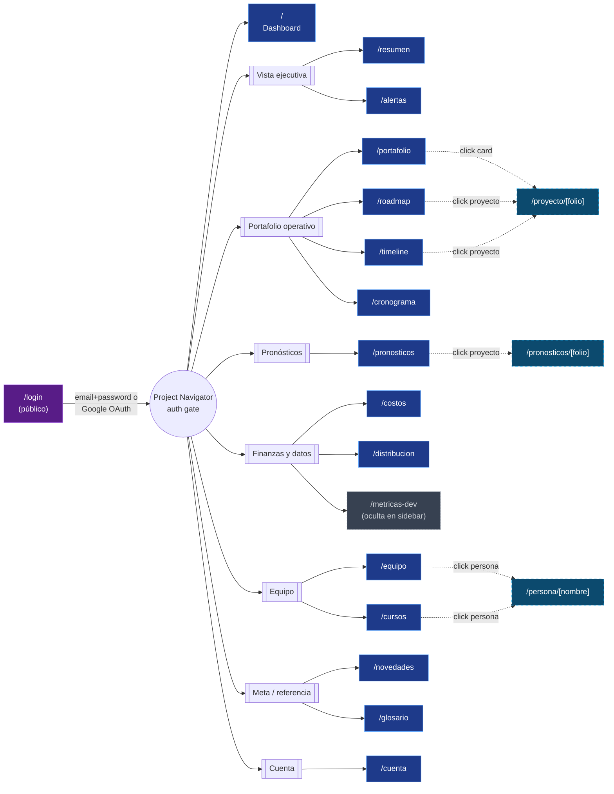
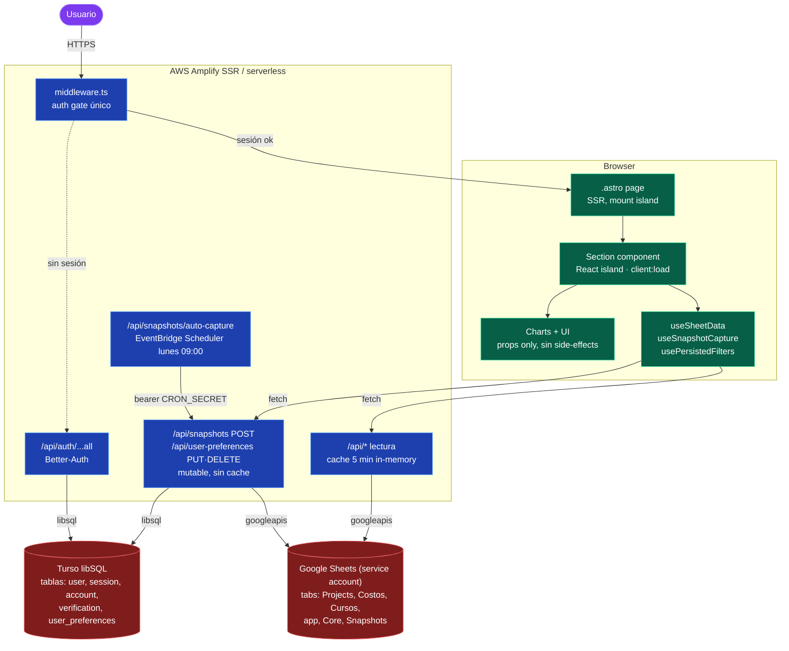
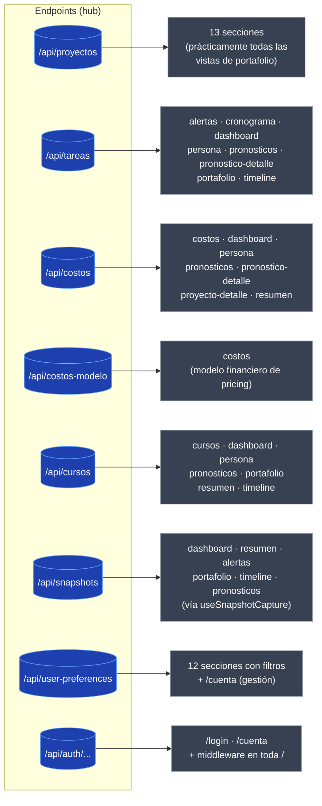
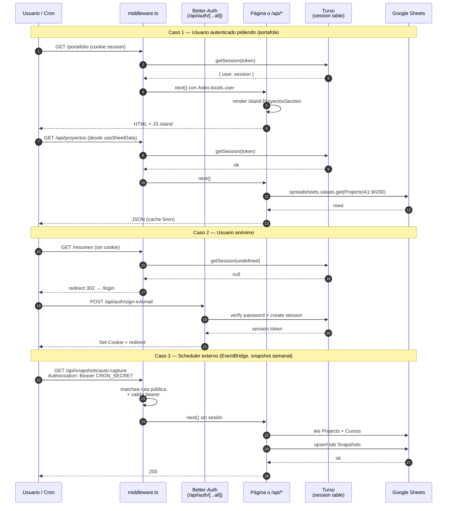

# Diagramas — Project Navigator

Vistas estructurales del producto en formato Mermaid. GitHub renderiza los bloques `mermaid` de forma nativa; en VS Code basta con la extensión *Markdown Preview Mermaid Support*.

Estos diagramas son derivados del código fuente. Si agregas una ruta, endpoint o sección nueva, actualízalos junto con el PR — el README de `dev/` incluye el orden esperado del sidebar y la matriz de secciones.

Archivos fuente de referencia:

- Sidebar y orden de navegación: [src/components/layout/Sidebar.tsx](../../../src/components/layout/Sidebar.tsx)
- Páginas: [src/pages/](../../../src/pages/)
- Endpoints SSR: [src/pages/api/](../../../src/pages/api/)
- Sections: [src/components/sections/](../../../src/components/sections/)
- Middleware de auth: [src/middleware.ts](../../../src/middleware.ts)

---

## 1. Sitemap (mapa del sitio)

Rutas accesibles a un usuario autenticado, agrupadas por intención de uso. Las rutas dinámicas se muestran con borde punteado; `/metricas-dev` existe pero no está enlazada en el sidebar (decisión de producto — ver `CHANGELOG` v1.1.0).

**Convenciones del diagrama**:

| Estilo | Significado |
|---|---|
| Azul sólido | Ruta presente en el sidebar (desktop + bottom-nav móvil) |
| Azul punteado | Ruta dinámica con parámetro (`[folio]`, `[nombre]`) |
| Gris punteado | Ruta existente pero no enlazada en sidebar |
| Morado | Ruta pública (no requiere sesión) |
| Flecha punteada `-.->` | Navegación lateral (click sobre un ítem) |

---

## 2. Arquitectura de capas

Cómo se mueve una petición desde el navegador hasta las fuentes de datos. El **middleware** es la única puerta de auth (ver [auth.md](./auth.md)); las **sections** son la única capa que llama hooks de datos (ver [convenciones.md](./convenciones.md)).

**Reglas que el diagrama materializa**:

1. **Middleware único**: todo el tráfico autenticado pasa por `src/middleware.ts`. Los endpoints nuevos heredan auth sin código adicional.
2. **Sections son los únicos consumidores de datos**: charts y UI reciben todo por props.
3. **Cache 5 min sólo en lectura**: los endpoints que escriben (`POST /api/snapshots`, `PUT /api/user-preferences`) no cachean.
4. **Dos fuentes desacopladas**: Google Sheets para datos operativos (proyectos, tareas, cursos, costos), Turso para auth + preferencias per-user.

---

## 3. Páginas → API endpoints

Qué endpoints consume cada sección. La columna `prefs` aplica a toda sección con filtros persistidos (`usePersistedFilters`); la columna `snapshots` aplica a las que invocan `useSnapshotCapture`.

### Matriz inversa (sección → endpoints)

| Sección | proyectos | tareas | costos | costos-modelo | cursos | snapshots | prefs |
|---|:-:|:-:|:-:|:-:|:-:|:-:|:-:|
| `/` Dashboard | ● | ● | ● |  | ● | ● | ● |
| `/resumen` | ● |  | ● |  | ● | ● | ● |
| `/alertas` | ● | ● |  |  |  | ● | ● |
| `/portafolio` | ● | ● |  |  | ● | ● | ● |
| `/proyecto/[folio]` | ● |  | ● |  |  |  |  |
| `/roadmap` | ● |  |  |  |  |  | ● |
| `/timeline` | ● | ● |  |  | ● | ● | ● |
| `/cronograma` |  | ● |  |  |  |  | ● |
| `/pronosticos` | ● | ● | ● |  | ● | ● | ● |
| `/pronosticos/[folio]` | ● | ● | ● |  |  |  |  |
| `/costos` | ● |  | ● | ● |  |  | ● |
| `/distribucion` | ● |  |  |  |  |  | ● |
| `/equipo` | ● |  |  |  |  |  |  |
| `/cursos` |  |  |  |  | ● |  | ● |
| `/persona/[nombre]` | ● | ● | ● |  | ● |  |  |
| `/metricas-dev` | ● |  |  |  |  |  | ● |
| `/cuenta` |  |  |  |  |  |  | ● |

> Las secciones que no aparecen (`/novedades`, `/glosario`) no consumen datos remotos: leen del repo (`CHANGELOG.md` y `src/data/glossary.ts`).

---

## 4. Flujo de auth (request lifecycle)

Cómo cada request se evalúa contra el middleware antes de llegar a la página o al endpoint. Cubre los tres caminos: usuario logueado, usuario anónimo, y el cron (scheduler externo).

**Detalles importantes**:

- El middleware popula `Astro.locals.user` y `Astro.locals.session` (tipados en [src/env.d.ts](../../../src/env.d.ts)). Cualquier `.astro` puede consumirlos en el frontmatter sin re-validar.
- React islands acceden a la sesión vía `authClient.useSession()` (cliente), sin necesidad de un endpoint extra.
- `useSheetData` detecta 401 en cualquier `/api/*` y redirige automáticamente a `/login`. Por eso una sesión expirada nunca llega a la UI como "datos vacíos".
- El cron de snapshots es la **única** excepción a la regla de "todo requiere sesión": el scheduler externo (EventBridge) debe enviar el header `Authorization: Bearer <CRON_SECRET>`.

---

## Mantenimiento

Cuando cambies estructura del producto, actualiza este archivo siguiendo el checklist:

| Cambio en el código | Diagrama a tocar |
|---|---|
| Nueva ruta en el sidebar (`Sidebar.tsx`) | 1 (sitemap), 3 (matriz) |
| Nueva ruta dinámica `[param]` | 1 (sitemap con borde punteado) |
| Nuevo endpoint en `src/pages/api/` | 2 (capas), 3 (hub + matriz) |
| Cambio en autenticación o middleware | 2 (capas), 4 (sequence) |
| Nueva fuente de datos (e.g. otra DB) | 2 (capas, subgraph Data + Tabs) |

Para validar que los diagramas renderizan sin errores antes de hacer commit, basta con abrir el archivo en VS Code con *Markdown Preview Mermaid Support* o pegar cada bloque en [mermaid.live](https://mermaid.live).
